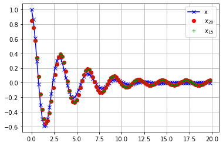
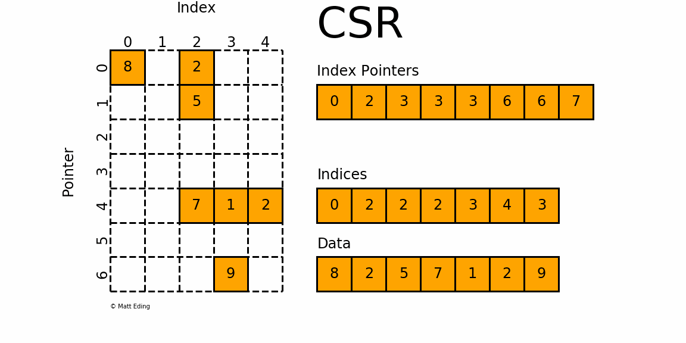

---
# try also 'default' to start simple
theme: seriph
# random image from a curated Unsplash collection by Anthony
# like them? see https://unsplash.com/collections/94734566/slidev
background: https://source.unsplash.com/collection/94734566/1920x1080
# apply any windi css classes to the current slide
class: 'text-center'
position: 'center'
# https://sli.dev/custom/highlighters.html
highlighter: shiki
# show line numbers in code blocks
lineNumbers: false
# some information about the slides, markdown enabled
info: |
  ## Slidev Starter Template
  Presentation slides for developers.

  Learn more at [Sli.dev](https://sli.dev)
# persist drawings in exports and build
drawings:
  persist: true
---

# Scipy

<style>
h1 {
  background-color: #2B90B6;
  background-image: linear-gradient(45deg, #4EC5D4 10%, #146b8c 20%);
  background-size: 100%;
  -webkit-background-clip: text;
  -moz-background-clip: text;
  -webkit-text-fill-color: transparent;
  -moz-text-fill-color: transparent;
}
</style>


Nhóm 6: 
<div style="text-align: center" > Nguyễn Chí Thanh</div>
<div style="text-align: center"> Đoàn Đại Thanh Long</div>
<div style="text-align: center"> Lê Thị Thắm</div>

<!--
The last comment block of each slide will be treated as slide notes. It will be visible and editable in Presenter Mode along with the slide. [Read more in the docs](https://sli.dev/guide/syntax.html#notes)
-->

---

# MỤC LỤC


- Giới thiệu và tổng quan về Scipy
- Cấu trúc thư viện
- Chi tiết các module

<br>
<br>


<!--
You can have `style` tag in markdown to override the style for the current page.
Learn more: https://sli.dev/guide/syntax#embedded-styles
-->

<style>
h1 {
  background-color: #2B90B6;
  background-image: linear-gradient(45deg, #4EC5D4 10%, #146b8c 20%);
  background-size: 100%;
  -webkit-background-clip: text;
  -moz-background-clip: text;
  -webkit-text-fill-color: transparent;
  -moz-text-fill-color: transparent;
}
</style>

---

# 1. Giới thiệu và tổng quan về Scipy

- Scipy là một thư viện mã nguồn mở dành cho toán học, khoa học và kỹ thuật. Scipy bao gồm các module về thống kê, tối ưu hóa, tích phân, đại số tuyến tính, xử lý tín hiệu,…

- Các đặc điểm của Scipy:
  - Mã nguồn mở
  - Dễ sử dụng, cộng đồng lớn
  - Hiệu năng cao
  - Dựa trên numpy, phù hợp tính toán với các mảng nhiều chiều
  - Áp dụng được trên nhiều lĩnh vực
Cung cấp nhiều công cụ liên quan đến toán học, thống kê,…
Liên quan mật thiết đến các thư viện tạo nên một hệ sinh thái: Numpy, Matplotlib, Scipy, Scikit-Image, Scikit-learn,…

<style>
h1 {
  background-color: #2B90B6;
  background-image: linear-gradient(45deg, #4EC5D4 10%, #146b8c 20%);
  background-size: 100%;
  -webkit-background-clip: text;
  -moz-background-clip: text;
  -webkit-text-fill-color: transparent;
  -moz-text-fill-color: transparent;
}
</style>

---

# 1. Giới thiệu và tổng quan về Scipy

- Lộ trình phát triển

  - Hỗ trợ GPU
  - Cải thiện hiệu năng
  - Tăng cường hỗ trợ thống kê
  - Hỗ trợ trên nhiều nền tảng
  - Hỗ trợ CI/CD tốt hơn

---

# 2. Cấu trúc thư viện

|Module| Miêu tả|
|------|---------|
|cluster|Các thuật toán phân cụm (Scikit-learn cũng có)|
|fftpack|Các hàm biến đổi Fourier nhanh (cũ)|
|fft|Các hàm biến đổi Fourier|
|special| Các hàm toàn học đặc biệt|
|signal| Các thuật toàn xử lý tín hiệu|
|linagl|Các thuật toán đại số tuyến tính|
|optimize| Các thuật toán tối ưu hóa và tìm root|
|sparse| Các chương trình liên quan đến ma trận thưa|
|weave| Công cụ cho phép sử dụng C/C++ trong code Python|


<style>
h1 {
  background-color: #2B90B6;
  background-image: linear-gradient(45deg, #4EC5D4 10%, #146b8c 20%);
  background-size: 100%;
  -webkit-background-clip: text;
  -moz-background-clip: text;
  -webkit-text-fill-color: transparent;
  -moz-text-fill-color: transparent;
}
</style>
---
---

# 2. Cấu trúc thư viện

|Module| Miêu tả|
|------|---------|
|constants|Các hằng số toán học và vật lý|
|integrate|Các hàm tính tích phân|
|io|Thao tác nhập xuất dữ liệu|
|ndimage|Các thuật toán xử lý ảnh|
|odr|Hồi quy khoảng cách trực giao|
|spatial| Các thuật toàn và cấu trực dữ liệu về không gian|
|stats| Các hàm, các phân phối về thống kê|
|misc| Một số hàm, công cụ khác|

<style>
h1 {
  background-color: #2B90B6;
  background-image: linear-gradient(45deg, #4EC5D4 10%, #146b8c 20%);
  background-size: 100%;
  -webkit-background-clip: text;
  -moz-background-clip: text;
  -webkit-text-fill-color: transparent;
  -moz-text-fill-color: transparent;
}
</style>
---
---
# cluster

- Phân cụm là thủ tục chia các tập dữ liệu thành các nhóm bao gồm các điểm dữ liệu giống nhau. Ví dụ, các mặt hàng được sắp xếp trong trung tâm mua sắm. Các Điểm Dữ liệu trong cùng một nhóm phải giống nhau nhất có thể và phải khác với các nhóm khác. Có hai loại cụm, đó là:
    - Trung tâm
    - Phân cấp
- K-means là một thuật toán rất phổ biến

<style>
h1 {
  background-color: #2B90B6;
  background-image: linear-gradient(45deg, #4EC5D4 10%, #146b8c 20%);
  background-size: 100%;
  -webkit-background-clip: text;
  -moz-background-clip: text;
  -webkit-text-fill-color: transparent;
  -moz-text-fill-color: transparent;
}

</style>
---
---
# cluster

<style>
h1 {
  background-color: #2B90B6;
  background-image: linear-gradient(45deg, #4EC5D4 10%, #146b8c 20%);
  background-size: 100%;
  -webkit-background-clip: text;
  -moz-background-clip: text;
  -webkit-text-fill-color: transparent;
  -moz-text-fill-color: transparent;
}

</style>
|Hàm| Miêu tả|
|-------|--------|
|cluster.vq.whiten(obs, check_finite=True )|Chuẩn hóa các vector quan sát bằng cách chia từng phần tử cho độ lệch chuẩn của feature tương ứng|
|cluster.vq.vq(obs, code_book, check_finite=True)|Gán các vector vào một codebook|
|cluster.vq.kmeans(obs, k_or_guess, iter=20, thresh=1e-05, check_finite=True)| Phân cụm K-means|
|cluster.vq.kmeans2(data,k,iter=10, thresh=1e-05, minit='random', missing='warn', check_finite=True)|Phân cụm K-means|

---

# cluster

### Input
```python
from numpy import vstack,array  
from numpy.random import rand  
from cluster.vq import kmeans, vq, whiten  
# data generation with three features  
data1 = vstack((rand(100,3) + array([.5,.5,.5]),rand(100,3))
# whitening of data  
data1 = whiten(data)  
# computing K-Means with clusters   
centroids, _ = kmeans(data1,3)  
print(centroids)
```

### Output

```python
[[1.97955982 1.78985952 1.51775359]
 [2.6926236  2.70116313 2.75279787]
 [0.84636826 0.93081751 1.0708057 ]]
```

<style>
h1 {
  background-color: #2B90B6;
  background-image: linear-gradient(45deg, #4EC5D4 10%, #146b8c 20%);
  background-size: 100%;
  -webkit-background-clip: text;
  -moz-background-clip: text;
  -webkit-text-fill-color: transparent;
  -moz-text-fill-color: transparent;
}

</style>

---

# cluster

- Ví dụ:
```python
import numpy as np
from scipy.cluster.vq import vq, kmeans, whiten, kmeans2
import matplotlib.pyplot as plt
pts = 50
rng = np.random.default_rng()
a = rng.multivariate_normal([0, 0], [[4, 1], [1, 4]], size=pts)
b = rng.multivariate_normal([30, 10],
                            [[10, 2], [2, 1]],
                            size=pts)
features = np.concatenate((a, b))

whitened = whiten(features)

codebook, distortion = kmeans2(whitened, 2)

clusters = vq(whitened, codebook)[0]
color_map = {0: "c", 1: "b"}


colors_fn = np.vectorize(lambda x: color_map[x])
colors = colors_fn(clusters)
plt.scatter(whitened[:, 0], whitened[:, 1], c=colors)
plt.scatter(codebook[:, 0], codebook[:, 1], c='r')
plt.show()
```

---

# cluster


---

# cluster

- Một số hàm phân cụm phẳng từ phân cụm phân cấp:

|Hàm| Miêu tả|
|-----|------|
|scipy.cluster.hierachy.fcluster(Z, t[, criterion, depth, R, monocrit])|Tạo thành các cụm phẳng từ phân cụm phân cấp được xác định bởi ma trận liên kết đã cho|
|scipy.cluster.hierachy.fclusterdata(X, t[, criterion, metric, …])| Phân cụm dữ liệu sử dụng độ đo cho trước|
|scipy.cluster.hierachy.leaders(Z, T)| Trả về điểm gốc của phân cụm phân cấp|

---

# cluster

- Ví dụ:
```python
from scipy.cluster.hierarchy import ward, fcluster
from scipy.spatial.distance import pdist
a = rng.multivariate_normal([0, 0], [[4, 1], [1, 4]], 
                            size=pts)
b = rng.multivariate_normal([30, 10],
                            [[10, 2], [2, 1]],
                            size=pts)
c = rng.multivariate_normal([15, 15],
                            [[5, 8], [10, 3]],
                            size=pts)
X = np.concatenate((a, b, c))
Z = ward(pdist(X))
clusters = fcluster(Z, t=35, criterion='distance')
colors_map = ['#2200CC' ,'#D9007E' ,'#FF6600' ,'#FFCC00' ,'#ACE600' ,'#0099CC' ,
    '#8900CC' ,'#FF0000' ,'#FF9900' ,'#FFFF00' ,'#00CC01' ,'#0055CC']
colors_fn = np.vectorize(lambda x: colors_map[x])
colors = colors_fn(clusters)

plt.scatter(X[:, 0], X[:, 1], c=colors)
plt.show()
```

---

# cluster


---

# cluster

- Phân cụm phân cấp:


---

# cluster

- Một số hàm phân cụm phân cấp:

|Hàm| Miêu tả|
|-----|------|
|scipy.cluster.hierachy.linkage(y[, method, metric, optimal_ordering])|Thực hiện phân cụm phân cấp/kết tụ|
|scipy.cluster.hierachy.single(y)|Thực hiện phân cụm phân cấp dựa trên khoảng cách gần nhất của các điểm giữa các cụm|
|scipy.cluster.hierachy.complete(y)|Thực hiện phân cụm phân cấp dựa trên khoảng cách xa nhất của các điểm giữa các cụm|
|scipy.cluster.hierachy.average(y)|Thực hiện phân cụm phân cấp dựa trên khoảng cách trung bình của các điểm giữa các cụm|
|scipy.cluster.hierachy.weighted(y)|Thực hiện phân cụm phân cấp dựa trên trọng số của các điểm giữa các cụm|
|scipy.cluster.hierachy.centroid(y)|Thực hiện phân cụm phân cấp dựa trên khoảng cách giữa các trọng tâm của các cụm|

---
layout: two-cols
---

# cluster

```python
from scipy.cluster.hierarchy import dendrogram, linkage
from matplotlib import pyplot as plt
a = rng.multivariate_normal([0, 0], [[4, 1], [1, 4]], 
                            size=10)
b = rng.multivariate_normal([30, 10],
                            [[10, 2], [2, 1]],
                            size=10)
c = rng.multivariate_normal([15, 15],
                            [[5, 8], [10, 3]],
                            size=10)
X = np.concatenate((a, b, c))
Z = linkage(X, 'ward')
fig = plt.figure(figsize=(25, 10))
dn = dendrogram(Z)
Z = linkage(X, 'single')
fig = plt.figure(figsize=(25, 10))
dn = dendrogram(Z)
plt.show()
```

::right::


---

# fft

- Module cho phép biển đổi Fourier rời rạc, phép biển đổi cosine,…

- Ảnh fourier $y[k]$ của dãy $x[k]$ độ dài $N$:

$$
y[k] = \sum_{n = 0}^{N - 1} \exp\Big(-2 \pi j \frac{kn}{N}\Big)x[n]
$$

- Và phép biến đổi ngược
$$x[n] = \frac{1}{N} \sum_{k = 0} ^ {N - 1} \exp\Big(2 \pi j \frac{kn}{N}\Big)y[k]$$

<style>
h1 {
  background-color: #2B90B6;
  background-image: linear-gradient(45deg, #4EC5D4 10%, #146b8c 20%);
  background-size: 100%;
  -webkit-background-clip: text;
  -moz-background-clip: text;
  -webkit-text-fill-color: transparent;
  -moz-text-fill-color: transparent;
}

</style>
---

# fft

- Một số hàm:

|Hàm| Miêu tả|
|-----|-----|
|fft(x[, n, axis, norm, overwrite_x, ...])| Thực hiện phép biển đổi Fourier cho tín hiệu 1 chiều|
|ifft(x[, n, axis, norm, overwrite_x, ...])| Thực hiện phép biển đổi Fourer nghịch cho tín hiệu 1 chiều|
|rfft(x[, n, axis, norm, overwrite_x, ...])| Thực hiện phép biến đổi Fourier cho tín hiệu thực|
|irfft(x[, n, axis, norm, overwrite_x, ...])| Thực hiện phép biến đổi Fourier nghịch cho tín hiệu thực|
|fft2(x[, s, axes, norm, overwrite_x, ...])| Thực hiện phép biển đổi Fourier cho tín hiệu 2 chiều|
|ifft2(x[, s, axes, norm, overwrite_x, ...])| Thực hiện phép biến đổi Fourier nghịch cho tín hiệu 2 chiều|

---

# fft

### Input
```python
from fft import fft, ifft
x = np.array([1.0, 2.0, 1.0, -1.0, 1.5])
y = fft(x)
y
```

### Output
```python
array([ 4.5       +0.j        ,  2.08155948-1.65109876j,
       -1.83155948+1.60822041j, -1.83155948-1.60822041j,
        2.08155948+1.65109876j])
```

### Input
```python
yinv = ifft(y)
yinv
```

### Output
```python
array([ 1.0+0.j,  2.0+0.j,  1.0+0.j, -1.0+0.j,  1.5+0.j])
```

<style>
h1 {
  background-color: #2B90B6;
  background-image: linear-gradient(45deg, #4EC5D4 10%, #146b8c 20%);
  background-size: 100%;
  -webkit-background-clip: text;
  -moz-background-clip: text;
  -webkit-text-fill-color: transparent;
  -moz-text-fill-color: transparent;
}
</style>

---
layout: two-cols
---


# fft

### Input
```python
from fft import fft, fftfreq
# Number of sample points
N = 600
# sample spacing
T = 1.0 / 800.0
x = np.linspace(0.0, N*T, N, endpoint=False)
y = np.sin(50.0 * 2.0*np.pi*x) + 0.5*np.sin(80.0 * 2.0*np.pi*x)
yf = fft(y)
xf = fftfreq(N, T)[:N//2]
import matplotlib.pyplot as plt
plt.plot(xf, 2.0/N * np.abs(yf[0:N//2]))
plt.grid()
plt.show()
```
::right::


<style>
h1 {
  background-color: #2B90B6;
  background-image: linear-gradient(45deg, #4EC5D4 10%, #146b8c 20%);
  background-size: 100%;
  -webkit-background-clip: text;
  -moz-background-clip: text;
  -webkit-text-fill-color: transparent;
  -moz-text-fill-color: transparent;
}
</style>
---

# fft

- Ví dụ:

```python
from scipy.fft import fftfreq
freq = fftfreq(8, 0.01)
freq
```

```python
array([  0. ,  12.5,  25. ,  37.5, -50. , -37.5, -25. , -12.5])
```

```python
from scipy.fft import fftshift
freq = fftfreq(8, 0.01)
freq
fftshift(freq)
```

```python
array([-50. , -37.5, -25. , -12.5,   0. ,  12.5,  25. ,  37.5])
```


---

# fft

```python
from scipy.fft import fft, rfft, irfft
x = np.array([1.0, 2.0, 1.0, -1.0, 1.5, 1.0])
fftfreq(x.shape[0]), fft(x)
```

```python
(array([ 0.        ,  0.16666667,  0.33333333, -0.5       , -0.33333333,
        -0.16666667]),
 array([ 5.5 -0.j        ,  2.25-0.4330127j , -2.75-1.29903811j,
         1.5 -0.j        , -2.75+1.29903811j,  2.25+0.4330127j ]))
```

```python
yr = rfft(x)
yr
```

```python
array([ 5.5 +0.j        ,  2.25-0.4330127j , -2.75-1.29903811j,
        1.5 +0.j        ])
```

```python
irfft(yr)
```

```python
array([ 1. ,  2. ,  1. , -1. ,  1.5,  1. ])
```

---
layout: two-cols
---

# fft

```python
from scipy.fft import fft, fftfreq, fftshift
import matplotlib.pyplot as plt
N = 400
T = 1.0 / 800.0
x = np.linspace(0.0, N*T, N, endpoint=False)
y = np.exp(50.0 * 1.j * 2.0*np.pi*x) + 0.5*np.exp(-80.0 * 1.j * 2.0*np.pi*x)
yf = fft(y)
xf = fftfreq(N, T)
xf = fftshift(xf)
yplot = fftshift(yf)
fig, axs = plt.subplots(2)
axs[0].plot(x, y)
axs[0].grid()
axs[1].plot(xf, 1.0/N * np.abs(yplot))
axs[1].grid()
plt.show()
```

::right::


---

# fft

## Phép biển đổi cosine

- Là một phép biến đổi gần tương tự như phép biến đổi Fourier nhưng chỉ sử dụng cho tín hiệu thực

- Có nhiều loại biến đổi cosine nhưng chỉ có 4 loại phổ biến

- Thường được dùng trong các bài toán phân tích tín hiệu, xử lý hình ảnh, nén tín hiệu

---

# fft

- Biến đổi cosine loại I (```norm=None```):

$$y[k]=x[0] + (-1)^kx[N-1]+2\sum_{n=1}^{N-2}x[n]\cos\big(\dfrac{\pi nk}{N-1}\big)$$

- Biến đổi cosine loại II (```norm=None```):

$$y[k]=2\sum_{n=0}^{N-1}x[n]\cos\Big(\dfrac{\pi(2n+1)k}{N}\Big)$$

- Biến đổi cosine loại III (```norm=None```):

$$y[k]=x[0]+2\sum_{n=1}^{N-1}x[n]\cos\Big(\dfrac{\pi(2k+1)n}{N}\Big)$$


---

# fft

- Biến đổi cosine loại III (```norm="ortho"```):

$$y[k]=\frac{x[0]}{\sqrt{N}}+\frac{2}{\sqrt{N}}\sum_{n=1}^{N-1}x[n]\cos\Big(\dfrac{\pi(2k+1)n}{N}\Big)$$

- Biến đổi cosine loại IV (```norm=None```):

$$y[k]=2\sum_{n=0}^{N-1}x[n]\cos\Big(\dfrac{\pi(2k+1)(2n+1)}{N}\Big)$$

- Biến đổi cosine loại IV (```norm="ortho"```):

$$y[k]=\sqrt{\frac{2}{N}}\sum_{n=0}^{N-1}x[n]\cos\Big(\dfrac{\pi(2k+1)(2n+1)}{N}\Big)$$

- Biến đổi cosine loại II và III là biến đổi ngược của nhau

---

# fft

- Các hàm biến đổi cosine rời rạc:

|Hàm| Miêu tả|
|-----|-----|
|dct(x[, type, n, axis, norm, overwrite_x, ...])| Thực hiện biến đổi cosine rời rạc cho tín hiệu đầu vào|
|idct(x[, type, n, axis, norm, overwrite_x, ...])|Thực hiện biến đổi cosine ngược|


---

# fft

- Ví dụ

```python
from scipy.fft import dct, idct
x = np.array([1.0, 2.0, 1.0, -1.0, 1.5])
y = dct(x, type=2, norm='ortho')
z = dct(y, type=3, norm='ortho')
print(y, z)
```

```python
[ 2.01246118  0.81449363  0.45127314 -1.99037688  0.60938703] [ 1.   2.   1.  -1.   1.5]
```

```python
e = dct(x, type=2, norm=None)
t = dct(e, type=3, norm=None)
print(e, t)
```

```python
[ 9.          2.575655    1.42705098 -6.29412435  1.92705098] [ 10.  20.  10. -10.  15.]
```

```python
idct(dct(x, type=2), type=2)
```

```python
array([ 1. ,  2. ,  1. , -1. ,  1.5])
```

---
layout: two-cols
---


# fft

- Ví dụ: Ứng dụng cho bài toán nén dữ liệu

```python
from scipy.fft import dct, idct
import matplotlib.pyplot as plt
N = 100
t = np.linspace(0,20,N, endpoint=False)
x = np.exp(-t/3)*np.cos(2*t)
y = dct(x, norm='ortho')
window = np.zeros(N)
window[:20] = 1
yr = idct(y*window, norm='ortho')
sum(abs(x-yr)**2) / sum(abs(x)**2)
```
```python
0.0009872817275276078
```

```python
window = np.zeros(N)
window[:15] = 1
yrr = idct(y*window, norm='ortho')
sum(abs(x-yrr)**2) / sum(abs(x)**2)
plt.plot(t, x, '-bx')
plt.plot(t, yr, 'ro')
plt.plot(t, yrr, 'g+')
plt.legend(['x', '$x_{20}$', '$x_{15}$'])
plt.grid()
plt.show()
```

```python
0.06196643004256714
```

::right::



---

# special

- Gồm nhiều các hàm đặc biệt của toán học và vật lý. Một số hàm nổi tiếng như hàm Bessel, đa thức Legendre, hàm Fresnel, 
Gamma, lý thuyết thông tin...

- Hàm Bessel là một họ các lời giải của phương trình vi phân Bessel: 
$$x^2\frac{d^2y}{dx^2} + x\frac{dy}{dx} + (x^2 - \alpha^2)y = 0$$
$\alpha$ là bậc của phương trình vi phân Bessel

Nghiệm của phương trình:

$$J_0(x) = \frac{sin(x)}{x}$$
$$J_1(x) = \frac{sin(x)}{x^2} - \frac{cos(x)}{x}$$
$$J_n(x)=\sum_{k=0}^{\infty}\frac{(-1)^k}{k!\Gamma(n + k + 1)}(\frac{x}{2})^{n + 2k}$$

<style>
h1 {
  background-color: #2B90B6;
  background-image: linear-gradient(45deg, #4EC5D4 10%, #146b8c 20%);
  background-size: 100%;
  -webkit-background-clip: text;
  -moz-background-clip: text;
  -webkit-text-fill-color: transparent;
  -moz-text-fill-color: transparent;
}
</style>
---

# special


| Hàm | Miêu tả |
|------|--------|
|special.jn_zeros(n, nt)|Tính điểm 0 thứ nt của hàm $J_n(x)$ |

<style>
h1 {
  background-color: #2B90B6;
  background-image: linear-gradient(45deg, #4EC5D4 10%, #146b8c 20%);
  background-size: 100%;
  -webkit-background-clip: text;
  -moz-background-clip: text;
  -webkit-text-fill-color: transparent;
  -moz-text-fill-color: transparent;
}
</style>

---

# special

- Đa thức Legendre là nghiệm của phương trình vi phân:
$$\frac{d}{dx}\Big[(1 - x^2)\frac{d}{dx}P_n(x)\Big] + n(n + 1)P_n(x) = 0$$

| Hàm | Miêu tả |
|------|--------|
|special.legendre(n, monic=False)|Trả về các hệ số của đa thức bậc n là nghiệm của phương trình vi phân Legendre |

Input:

```python
from special import legendre
legendre(3)
```

Output:
```python
poly1d([ 2.5,  0. , -1.5,  0. ])
```
<style>
h1 {
  background-color: #2B90B6;
  background-image: linear-gradient(45deg, #4EC5D4 10%, #146b8c 20%);
  background-size: 100%;
  -webkit-background-clip: text;
  -moz-background-clip: text;
  -webkit-text-fill-color: transparent;
  -moz-text-fill-color: transparent;
}
</style>
---

# special

- Hàm Gamma có công thức:

$$\Gamma(z) = \int_0^{\infty}t^{z-1}e^{-t}dt$$

| Hàm| Miểu tả|
|-----|------|
|special.gamma(z)| Tính giá trị hàm gamma tại z|

Input:
```python
from special import gamma
gamma([0, 0.5, 1, 5])
```
Output:
```python
array([         inf,   1.77245385,   1.        ,  24.        ])
```
<style>
h1 {
  background-color: #2B90B6;
  background-image: linear-gradient(45deg, #4EC5D4 10%, #146b8c 20%);
  background-size: 100%;
  -webkit-background-clip: text;
  -moz-background-clip: text;
  -webkit-text-fill-color: transparent;
  -moz-text-fill-color: transparent;
}
</style>
---

# special
- Một số hàm lý thuyết thông tin:

| Hàm | Miêu tả |
|-----|---------|
|special.entr(x)| Tính entropy cho một số|
|rel_entr(x, y[, out])| Tính Kullback-Leibler divergence|
|huber(delta, r)| Tính huber loss|
|pseudo_huber(delta, r)| Tính pseudo huber loss|

<style>
h1 {
  background-color: #2B90B6;
  background-image: linear-gradient(45deg, #4EC5D4 10%, #146b8c 20%);
  background-size: 100%;
  -webkit-background-clip: text;
  -moz-background-clip: text;
  -webkit-text-fill-color: transparent;
  -moz-text-fill-color: transparent;
}
</style>
---


# signal

- Module cung cấp các công cụ như các phép lọc, tính tích chập, nội suy, phân tích hệ thống, hàm truyền,...

- Phép tính tích chập:

$$y[n]=\sum_{k=-\infty}^{\infty}x[k]h[n-k]$$

- Nhưng tín hiệu $x[n]$ và hệ số bộ lọc $h[k]$ không kéo dài vô hạn. Gọi $K + 1$ là độ dài của chuỗi tín hiệu $x[n]$ và độ dài của bộ lọc $h[k]$ là $M + 1$

$$y[n]=\sum_{k=\max(n - M, 0)}^{\min(n, K)}x[k]h[n-k]$$

---
layout: two-cols
---

# signal

- Khai triển:
$$y[0] = x[0]h[1]$$
$$y[1] = x[0]h[1] + x[1]h[0]$$
$$...$$
$$y[M]=\sum_{k=0}^{M}x[k]h[M-k]=x[0]h[M]+x[1]h[M - 1] + ... + x[M]h[0]$$
$$y[M+1]=\sum_{k=1}^{M+1}x[k]h[M+1-k]=x[1]h[M]+...+x[M+1]h[0]$$
$$...$$

$$y[K]=\sum_{k=K-M}^{K}x[k]h[K-k]=x[K-M]h[M]+...+x[K]h[0]$$

$$...$$

$$y[M+K]=\sum_{k=K}^{K}x[k]h[M+K-k]=x[K]h[K]$$

::right::

| Hàm | Miêu tả|
|-----|--------|
|signal.convolve(in1, in2, mode='full', method='auto')| Tính tích chập|
|signal.convolve2d(in1, in2, mode='full', boundary='fill', fillvalue=0)|Tính tích chập 2 chiều|
|signal.correlate(in1, in2, mode='full', method='auto')|Tính tương quan giữa hai tín hiệu|

<style>
.katex { font-size: 0.8em; }
</style>

---
layout: two-cols
---

# signal

- Ví dụ áp dụng tích chập cho ảnh:

```python
import numpy as np
from scipy import signal, misc
import matplotlib.pyplot as plt
image = misc.face(gray=True)
w = np.random.rand(50, 50)
image_new = signal.fftconvolve(image, w)
plt.figure()
plt.imshow(image)
plt.gray()
plt.title('Original image')
plt.show()
```

```python
plt.figure()
plt.imshow(image_new)
plt.gray()
plt.title('Filtered image')
plt.show()
```

::right::


---

# signal

- Một hệ thống hay bộ lọc được biểu diễn dưới dạng phương trình vi phân:

$$a_n\frac{d^ny}{dt^n} + a_{n-1} \frac{d^{n-1}y}{dt^{n-1}} + ...+a_0y=b_m\frac{d^mu}{dt^m}+b_{m-1}\frac{d^{m-1}u}{dt^{m-1}}+...+b_0u$$

- Hoặc sử dụng hàm truyền (ảnh Laplace):

$$G(s)=\frac{Y(s)}{U(s)}=\frac{b_m s^m+b_{m-1}s^{m-1} + b_0}{a_n s^n + a_{n-1} s^{n-1} +...+ a_0}$$

- Mô hình không gian trạng thái:

$$\begin{cases} \frac{d\underline{x}}{dt} = A\underline{x} + B\underline{u}\\ \underline{y}=C\underline{x} + D\underline{u}\end{cases}$$

- Chuyển mô hình không gian trạng thái sang hàm truyền:

$$G(s)=C(sI-A)^{-1}B + D$$

<style>
.katex { font-size: 0.95em; }
</style>

---

# signal

- Phương trình sai phân: ứng dụng trong các hệ thống điều khiển số, phân tích bộ lọc

$$\sum_{k=0}^{k=N} a_k y[n-k]=\sum_{k=0}^{M} b_k x[n - k]$$

- Phương trình sai phân còn được hay được biểu diễn dưới dạng phép biến đổi Z

$$Y(z)\big(\sum_{k=0}^{k=N}a_k z^{-k})=X(z)\big(\sum_{k=0}^{k=M}a_k z^{-k})$$

$$H(z)=\frac{Y(z)}{X(z)}=\frac{\sum_{k=0}^{k=M}a_k z^{-k}}{\sum_{k=0}^{k=N}a_k z^{-k}}$$

- Có thể biến đổi hàm truyền từ liên tục sang số

---

# signal

- Các hàm:

|Hàm| Miêu tả|
|---|--------|
|signal.lfilter(b, a, x, axis=-1, zi=None)|Thực hiện lọc chuỗi tín hiệu đầu vào $x$|
|signal.savgol_filter(x, window_length, polyorder, deriv=0, delta=1.0, axis=- 1, mode='interp', cval=0.0)|Thực hiện bộ lọc Savitzky - Golay lên tín hiệu đầu vào 1 chiều|

- Lớp:

|Lớp|Miêu tả|
|----|------|
|signal.lti(*system, **kwargs)| Tạo ra một instance lti|
|signal.TransferFunction(*system, **kwargs)| Tạo ra một instance hàm truyền|
|signal.StateSpace(*system, **kwargs)|Tạo ra một instance không gian trạng thái|

---

# signal

- Các hàm:

|Hàm| Miêu tả|
|-----|-------|
|signal.impulse(system, X0=None, T=None, N=None, **kwargs)| Đáp ứng của hệ thống trên miền thời gian với đầu vào là xung delta Dirac|
|signal.step(system, X0=None, T=None, N=None)| Đáp ứng của hệ thống trên miền thời gian với đầu vào là hàm bước nhảy đơn vị (hàm Heaviside)|
|signal.tf2ss(num, den)|Chuyển biểu diễn từ dạng hàm truyền sang không gian trạng thái|
|signal.bode(system, w=None, n=100)|Tính đồ thị biên, pha (đồ thị Bode) của hệ thống|


---

# signal

```python
x = np.array([1., 0., 0., 0.])
b = np.array([1.0/2, 1.0/4])
a = np.array([1.0, -1.0/3])
signal.lfilter(b, a, x)
```
```python
array([0.5       , 0.41666667, 0.13888889, 0.0462963 ])
```

---
layout: two-cols
---

# signal

- Cho hàm truyền $G(s)=\dfrac{s^2+3s+3}{s^2+2s+1}$

```python
num = [1, 3, 3]
den = [1, 2, 1]
sys = signal.TransferFunction(num, den)
t, y = signal.step(sys)
plt.plot(t, y)
plt.xlabel('Time [s]')
plt.ylabel('Amplitude')
plt.title('Step response')
plt.grid()
```

::right::


---
layout: two-cols
---

# signal

- Cho một tín hiệu $u(t)=\cos(4.2\pi t)+0.6\sin(40.2\pi t) + 0.5\cos(80.2\pi t)$ qua một bộ lọc thông thấp có hàm truyền $G(s)=\dfrac{5}{1+\frac{1}{5}s}$:

```python
num = [5]
den = [1/5, 1]
sys = signal.TransferFunction(num, den)
t = np.linspace(0, 1.25, 500, endpoint=False)
u = (np.cos(2*np.pi*4*t) + 0.6*np.sin(2*np.pi*40*t) +
     0.5*np.cos(2*np.pi*80*t))
tout, yout, xout = signal.lsim(sys, U=u, T=t)
fig, axs = plt.subplots(2)
axs[0].plot(t, u, 'r', alpha=0.5, linewidth=1, label='input')
axs[1].plot(tout, yout, 'k', linewidth=1.5, label='output')
axs[0].grid()
axs[1].grid()
plt.show()
```

::right::


---
layout: two-cols
---

# signal

- Bộ lọc Bessel cho tín hiệu $u(t)=\cos(4.2\pi t)+0.6\sin(40.2\pi t) + 0.5\cos(80.2\pi t)$:

```python
from scipy.signal import bessel, lsim
b, a = bessel(N=5, Wn=2*np.pi*12, btype='lowpass', analog=True)
t = np.linspace(0, 1.25, 500, endpoint=False)
u = (np.cos(2*np.pi*4*t) + 0.6*np.sin(2*np.pi*40*t) +
     0.5*np.cos(2*np.pi*80*t))
tout, yout, xout = lsim((b, a), U=u, T=t)
plt.plot(t, u, 'r', alpha=0.5, linewidth=1, label='input')
plt.plot(tout, yout, 'k', linewidth=1.5, label='output')
plt.legend(loc='best', shadow=True, framealpha=1)
plt.grid(alpha=0.3)
plt.xlabel('t')
plt.show()
```

::right::


---

# signal

- Thiết kế bộ lọc:

  - Bộ lọc IIR
  - Bộ lọc FIR

|Hàm|Miêu tả|
|-----|------|
|signal.firwin(numtaps, cutoff, width=None, window='hamming', pass_zero=True, scale=True, nyq=None, fs=None)| Trả về bộ lọc FIR|
|signal.iirdesign(wp, ws, gpass, gstop, analog=False, ftype='ellip', output='ba', fs=None)| Thiết kế bộ lọc IIR|
|signal.iirfilter(N, Wn, rp=None, rs=None, btype='band', analog=False, ftype='butter', output='ba', fs=None)| Thiết kế bộ lọc IIR|


---

# linalg


- Scipy Linalg được xây dựng dựa trên BLAS và LAPACK.
- Gồm tất cả các hàm có trong numpy.linalg nhưng nhanh hơn


---

# linalg

- Tạo ma trận

Input
```python
import numpy as np
from scipy import linalg
A = np.array([[1,2],[3,4]])
A
```

Output
```python
array([[1, 2],
       [3, 4]])
```

---

# linalg


Input
```python
linalg.inv(A)
```
Output
```python
array([[-2. ,  1. ],
       [ 1.5, -0.5]])
```
- Định thức của ma trận:
$$det(A)=\sum_{j=1}^n (-1)^{i+j}a_{ij}M_{ij}$$

Input
```python
A = np.array([[1,2],[3,4]])
linalg.det(A)
```

Output
```
-2.0
```

---

# linalg

- Chuẩn của vector và ma trận:

  - Vector:

$$\lVert x \rVert=\begin{cases} \max \lvert x_i \rvert & \text{ord}=\text{inf} \\ \min \lvert x_i \rvert & \text{ord}=-\text{inf} \\ \big(\sum_i \lvert x_i \rvert ^ {\text{ord}}\big)^{\frac{1}{\text{ord}}} & \text{ord} < \infty \end{cases} $$

  - Ma trận:

$$\lVert A \rVert=\begin{cases} \max_i \sum_j \lvert a_{ij} \rvert & \text{ord} = \text{inf} \\ \min_i \sum_j \lvert a_{ij} \rvert & \text{ord} = -\text{inf} \\ \max_j \sum_i \lvert a_{ij} \rvert & \text{ord} = 1 \\ \min_j \sum_i \lvert a_{ij} \rvert & \text{ord} = -1 \\ \max \sigma_i & \text{ord} = 2 \\ \sqrt{\text{trace}(A^HA)} & \text{ord} = "fro"\end{cases}$$


<style>
.katex { font-size: 0.9em; }
</style>

---

# linalg

Input

```python
print(linalg.norm(A))

print(linalg.norm(A,'fro'))

print(linalg.norm(A, 1))

print(linalg.norm(A, -1))

print(linalg.norm(A, np.inf))
```

Output
```python
5.477225575051661
5.477225575051661
6.0
4.0
7.0
```

---

# linalg

- Giải hệ phương trình tuyến tính:

Input

```python
import time
num_steps = 1000
start = time.time()
for _ in range(num_steps):
    linalg.solve(A, b)
end = time.time()
print((end - start)/num_steps)
start = time.time()
for _ in range(num_steps):
    np.linalg.solve(A, b)
end = time.time()
print((end - start)/num_steps)
```
Output
```python
2.097940444946289e-05
9.007692337036133e-06
```

---

# linalg

- Giải bài toán bình phương tối thiểu:

$$y_i = \sum_{j=1}^n c_j f_j(\bold{x}_i) + \epsilon_i$$

- Tìm $c_j$ sao cho cực tiểu hóa hàm mục tiêu:

$$J(\bold{c})=\sum_{i=0}^m\lvert y_i - \sum_{j=1}^n c_j f_j(\bold{x}_i)\rvert^2$$

- Đạo hàm riêng của $J(\bold{c})$ theo các $c_j$:
$$\dfrac{\partial J(\bold{c})}{c_n}=-2\sum_{i=1}^m\big(y_i - \sum_{j=1}^n c_j f_j(\bold{x}_i)\big)f_n(\bold{x}_i)=0$$

- Đặt $A$ sao cho $a_{ij}=f_j(\bold{x}_i)$

---

# linalg

- Phương trình thở thành:

$$A^TA\bold{c}=A^T \bold{y}$$

$$\Rightarrow \bold{c}=(A^TA)^{-1}A \bold{y}$$

|Hàm| Miêu tả|
|----|-------|
|linalg.lstsq|Giải hệ phương trình $A\bold{x}=b$ sao cho $\lVert A\bold{x} - b \rVert_2$ nhỏ nhất|
|linalg.pinv| Tính ma trận giả nghịch đảo của ma trận $A$|

---

# linalg

- Xét bài toán:

$$y_i = c_1 e^{-x_i} + c_2x_i$$

- Viết dưới dạng ma trận:

$$A\bold{c}=\bold{y}$$

$$\begin{bmatrix}e^{-x_1} & x_1 \\ e^{-x_2} & x_2 \\ ... & ... \\ e^{-x_n} & x_n \end{bmatrix} \begin{bmatrix} c_1 \\ c_2\end{bmatrix}=\begin{bmatrix} y_1 \\ y_2 \\ ... \\ y_n \end{bmatrix}$$

- Tìm $\bold{c}$ sao cho $\lVert A\bold{c} - y \rVert_2$ nhỏ nhất

---
layout: two-cols
---
# linalg

- Lời giải:

Input
```python
rng = np.random.default_rng()
c1, c2 = 5.0, 2.0
i = np.r_[1:11]
xi = 0.1*i
yi = c1*np.exp(-xi) + c2*xi
zi = yi + 0.05 * np.max(yi) * rng.standard_normal(len(yi))
A = np.c_[np.exp(-xi)[:, np.newaxis], xi[:, np.newaxis]]
c, resid, rank, sigma = linalg.lstsq(A, zi)
xi2 = np.r_[0.1:1.0:100j]
yi2 = c[0]*np.exp(-xi2) + c[1]*xi2
plt.plot(xi,zi,'x',xi2,yi2)
plt.axis([0,1.1,3.0,5.5])
plt.xlabel('$x_i$')
plt.grid()
plt.title('Data fitting with linalg.lstsq')
plt.show()
```

::right::


---

# linalg

- Phân tích ma trận:
  - Phân tích giá trị riêng:
$$\bold{A}=\bold{V}\bold{\Sigma} \bold{V}^{-1}$$
  - Phân tích SVD:
$$\bold{A}=\bold{U}\bold{\Sigma} \bold{V}^{T}$$
  - Phân tích LU:
$$\bold{A}=\bold{P}\bold{L} \bold{U}$$
  - Phân tích Cholesky:
$$\bold{A}=\bold{U}^H \bold{U}$$
  - Phân tích QR:
$$\bold{A}=\bold{Q} \bold{R}$$

<style>
.katex { font-size: 0.8em; }
</style>

---

# linalg

- Các hàm

|Hàm| Miêu tả|
|---|-----|
|linalg.eigvals| Trả về giá trị riêng|
|linalg.eig| Trả về giá trị riêng và các vector riêng|
|linalg.svd| Trả về các vector kỳ dị bên trái, giá trị kỳ dị và các vector kỳ dị bên phải|
|linalg.lu| Phân tích LU|
|linalg.cho_solve| Giải hệ với $\bold{A}$ đã được phân tích Cholesky|
|linalg.cho_factor| Phân tích Cholesky|
|linalg.qr| Phân tích QR|

---

# linalg

- Áp dụng hàm lên ma trận:
Xét khai triển Maclaurin của hàm $f(x)$:

$$f(x)=\sum_{k=0}^{\infty} \dfrac{f^{(k)}(0)}{k!}x^k$$

- Áp dụng hàm $f(x)$ lên ma trận $\bold{A}$:
$$f(\bold{A})=\sum_{k=0}^{\infty}\dfrac{f^{(k)}(0)}{k!}\bold{A}^k$$

- Hàm $e^x$ cho $\bold{A}$:
$$e^{\bold{A}}=\sum_{k=0}^{\infty}\dfrac{\bold{A}^k}{k!}$$

---

# linalg

- Hàm $\sin(x)$ cho $\bold{A}$:
$$\sin(\bold{A})=\dfrac{e^{j\bold{A}} - e^{-j\bold{A}}}{2j}$$

- Hàm $\cos(x)$ cho $\bold{A}$:
$$\cos(\bold{A})=\dfrac{e^{j\bold{A}} + e^{-j\bold{A}}}{2j}$$

- Hàm $\sinh(x)$ cho $\bold{A}$:

$$\sinh(\bold{A})=\dfrac{e^\bold{A}-e^{-\bold{A}}}{2}$$

- Hàm $\cosh(x)$ cho $\bold{A}$:
$$\cosh(\bold{A})=\dfrac{e^\bold{A}+e^{-\bold{A}}}{2}$$

<style>
  .katex {font-size: 1.0em;}
</style>

---

# linalg

- Các hàm tính cho ma trận:

|Hàm| Miêu tả|
|-----|-----|
|linalg.expm| Tính $e^{\bold{A}}$|
|linalg.sinm| Tính $\sin(\bold{A})$|
|linalg.cosm| Tính $\cos(\bold{A})$|
|linalg.tanm| Tính $\tan(\bold{A})$|
|linalg.sinhm| Tính $\sinh(\bold{A})$|
|linalg.coshm| Tính $\cosh(\bold{A})$|
|linalg.tanhm| Tính $\tanh(\bold{A})$|
|linalg.funcm|Tính một hàm bất kỳ|

---

# linalg

- Ví dụ:

```python
from scipy import special, linalg
rng = np.random.default_rng()
A = rng.random((3, 3))
B = linalg.funm(A, lambda x: special.jv(0, x))
A
array([[0.06369197, 0.90647174, 0.98024544],
       [0.68752227, 0.5604377 , 0.49142032],
       [0.86754578, 0.9746787 , 0.37932682]])
B
array([[ 0.6929219 , -0.29728805, -0.15930896],
       [-0.16226043,  0.71967826, -0.22709386],
       [-0.19945564, -0.33379957,  0.70259022]])
linalg.eigvals(A)
array([ 1.94835336+0.j, -0.72219681+0.j, -0.22270006+0.j])
special.jv(0, linalg.eigvals(A))
array([0.25375345+0.j, 0.87379738+0.j, 0.98763955+0.j])
linalg.eigvals(B)
array([0.25375345+0.j, 0.87379738+0.j, 0.98763955+0.j])
```

---

# sparse

- Trong nhiều bài toán thực tế, xuất hiện những ma trận có kích thước lớn, nhưng chỉ một số ít những phần tử khác 0, các ma trận này được gọi là các ma trận thưa (sparse).
- Việc lưu trữ toàn bộ ma trận này tốn kém.
- Thay vì lưu trữ toàn bộ ma trận, chỉ cần lưu kích thước, vị trí các phần tử khác 0 và giá trị tại vị trí tương ứng
- Có nhiều cách để biểu diễn một ma trận thưa:

  - csc_matrix: Compressed Sparse Column format
  - csr_matrix: Compressed Sparse Row format
  - bsr_matrix: Block Sparse Row format
  - lil_matrix: List of Lists format
  - dok_matrix: Dictionary of Keys format
  - coo_matrix: COOrdinate format (aka IJV, triplet format)
  - dia_matrix: DIAgonal format

---

# sparse

## Compressed Sparse Column


---

# sparse

## Compressed Sparse Row



---

# sparse

## List of Lists


---

# sparse

## COOrdinate


---

# sparse

## DIAgonal


---

# optimize

- Tối ưu hóa đóng một vai trò quan trọng trong khoa học kỹ, thuật
- Rất nhiều bài toán được đưa về giải một bài toán tối ưu
- Đặc điểm:
  - Nhiều bài toán khó giải trực tiếp
  - Thường đưa về bài toán lặp nhiều bước

- Hàm ```optimize.minimize()``` được sử dụng nhiều

---

# optimize

## Tối ưu hóa không ràng buộc cho hàm đa biến vô hướng

- Xét hàm Rosenbrock:
$$f(\bold{x})=\sum_{i=1}^{N-1}100\big(x_{i+1} - x_i^2\big)^2 + (1-x_i)^2$$
- Dễ thấy hàm đạt cực tiểu khi $x_i=1$

### Phương pháp Nelder-Mead
- Là một phương pháp đơn giản, tuy nhiên thời gian hội tụ có thể lâu, không sử dụng tính gradient
---

# optimize

- Lời giải:
Input
```python
import numpy as np
from scipy.optimize import minimize

def rosen(x):
    return sum(100.0*(x[1:]-x[:-1]**2.0)**2.0 + (1-x[:-1])**2.0)

x0 = np.array([1.3, 0.7, 0.8, 1.9, 1.2])
res = minimize(rosen, x0, method='nelder-mead',
               options={'xatol': 1e-8, 'disp': True})

print(res.x)
```
Output
```python
Optimization terminated successfully.
         Current function value: 0.000000
         Iterations: 339
         Function evaluations: 571
array([1., 1., 1., 1., 1.])
```

---

# optimize

## Thuật toán Broyden - Fletcher - Goldfard - Shanno

- Có sử dụng đạo hàm
- Thay ```method="BFGS"``` để sử dụng thuật toán
- Có thể tính đạo hàm bằng tay đưa vào tham số ```jac```
- Nếu không chương trình sẽ tính đạo hàm bằng phương pháp sai phân bậc nhất

Đạo hàm của hàm Rosenbrock:

$$\dfrac{\partial f}{\partial x_j}=\sum_{i=1}^{N-1}200\big(x_i - x_{i-1}^2\big)(\delta_{i,j} - 2x_{i-1}\delta_{i-1,j})-2(1-x_{i-1})\delta_{i-1,j}\\=200(x_j - x_{j-1}^2) - 400(x_{j+1}-x_j^2) - 2(1-x_j)$$

Ứng với $j=0$ và $j=N-1$:

$$\dfrac{\partial f}{\partial x_0}=-400x_0\big(x_1 - x_0^2\big) - 2\big(1-x_0\big)$$

$$\dfrac{\partial f}{\partial x_{N-1}}=200\big(x_{N-1}-x_{N-2}^2\big)$$


<style>
.katex { font-size: 0.9em; }
</style>


---

# optimize

- Lời giải:

Input
```python
def rosen_der(x):
    xm = x[1:-1]
    xm_m1 = x[:-2]
    xm_p1 = x[2:]
    der = np.zeros_like(x)
    der[1:-1] = 200*(xm-xm_m1**2) - 400*(xm_p1 - xm**2)*x   - 2*(1-xm)
    der[0] = -400*x[0]*(x[1]-x[0]**2) - 2*(1-x[0])
    der[-1] = 200*(x[-1]-x[-2]**2)
    return der

res = minimize(rosen, x0, method='BFGS', jac=rosen_der,
               options={'disp': True})

print(res.x)

res = minimize(rosen, x0, method='BFGS', options={'disp': True})

print(res.x)
```

---

# optimize

Output
```python
Optimization terminated successfully.
         Current function value: 0.000000
         Iterations: 25
         Function evaluations: 30
         Gradient evaluations: 30
[1.00000004 1.0000001  1.00000021 1.00000044 1.00000092]
Optimization terminated successfully.
         Current function value: 0.000000
         Iterations: 25
         Function evaluations: 180
         Gradient evaluations: 30
[0.99999925 0.99999852 0.99999706 0.99999416 0.99998833]
```

---

# optimize

## Phương pháp Newton-Conjugate-Gradient

- Phương pháp Newton sử dụng xấp xỉ bậc 2:

$$f(\bold{x})\approx f(\bold{x}_0) + \nabla^T f(\bold{x}_0)(\bold{x} - \bold{x}_0) + \frac{1}{2}(\bold{x} - \bold{x}_0)^T\bold{H}(\bold{x}_0)(\bold{x} - \bold{x}_0)$$

$$\bold{x}_{opt}\approx \bold{x}_0-\bold{H}^{-1}\nabla f(\bold{x}_0)$$

- Thay ```method="Newton-CG"``` để sử dụng thuật toán
- Tính ma trận Hessian thay vào tham số ```hess```
- Ma trận Jacobi là bắt buộc
- Ma trận Hessian không bắt buộc

---

# optimize

- Lời giải:

Input:
```python
def rosen_hess(x):
    x = np.asarray(x)
    H = np.diag(-400*x[:-1],1) - np.diag(400*x[:-1],-1)
    diagonal = np.zeros_like(x)
    diagonal[0] = 1200*x[0]**2-400*x[1]+2
    diagonal[-1] = 200
    diagonal[1:-1] = 202 + 1200*x[1:-1]**2 - 400*x[2:]
    H = H + np.diag(diagonal)
    return H

res = minimize(rosen, x0, method='Newton-CG',
               jac=rosen_der, hess=rosen_hess,
               options={'xtol': 1e-8, 'disp': True})

print(res.x)
```
---

# optimize

Output
```python
Optimization terminated successfully.
         Current function value: 0.000000
         Iterations: 24
         Function evaluations: 33
         Gradient evaluations: 33
         Hessian evaluations: 24
[1.         1.         1.         0.99999999 0.99999999]
```

---

# optimize

- Thay vì lưu trữ cả ma trận Hessian (tốn tài nguyên bộ nhớ và tính toán), ta có thể lưu tích của ma trận Hessian với một vector bất kỳ do người dùng tính trước

- Đưa kết quả tính được vào tham số ```hessp``` trong hàm ```minimize```

$$f(\bold{x})\approx f(\bold{x}_0) + \nabla^T f(\bold{x}_0)(\bold{x} - \bold{x}_0) + \frac{1}{2}(\bold{x} - \bold{x}_0)^T\bold{H}(\bold{x}_0)\bold{p}$$

- Trong ví dụ trên:

$$\bold{H}(\bold{x}_0)\bold{p}=\begin{bmatrix} \big(1200x_0^2-400x_1+2\big)p_0 - 400x_0p_1 \\ \vdots \\ -400x_{i-1}+\big(202+1200x_i^2-400x_{i+1}\big)p_i-400x_i p_{i+1} \\ \vdots \\ -400x_{N-2}p_{N-2}+200p_{N-1}\end{bmatrix}$$

---

# optimize

- Lời giải:

Input
```python
def rosen_hess_p(x, p):
    x = np.asarray(x)
    Hp = np.zeros_like(x)
    Hp[0] = (1200*x[0]**2 - 400*x[1] + 2)*p[0] - 400*x[0]*p[1]
    Hp[1:-1] = -400*x[:-2]*p[:-2]+(202+1200*x[1:-1]**2-400*x[2:])*p[1:-1] \
               -400*x[1:-1]*p[2:]
    Hp[-1] = -400*x[-2]*p[-2] + 200*p[-1]
    return Hp
res = minimize(rosen, x0, method='Newton-CG',
               jac=rosen_der, hessp=rosen_hess_p,
               options={'xtol': 1e-8, 'disp': True})
print(res.x)
```
Output
```python
[1.         1.         1.         0.99999999 0.99999999]
```

---

# optimize

## Phương pháp Trust-Region Newton CG

- Giống với Newton CG, Trust Region Newton CG tìm một hướng làm cực tiểu hóa hàm mục tiêu và tìm một step size tối ưu

- Nhưng khác step size trong Trust Region được chọn sao cho điểm $x_k$ hiện tại không được vượt quá khỏi vùng có bán kính $\Delta$ cho trước

$$\bold{p}=\argmin_{\bold{p}}f(\bold{x}_k)+\nabla^Tf(\bold{x}_k)\bold{p}+\bold{p}^T\bold{H}(\bold{x}_k)\bold{p}$$
$$\lVert\bold{p}\rVert \leq \Delta$$

---

# optimize

- Lời giải

Input
```python
res = minimize(rosen, x0, method='trust-ncg',
               jac=rosen_der, hess=rosen_hess,
               options={'gtol': 1e-8, 'disp': True})
print(res.x)
```

Output
```python
Optimization terminated successfully.
         Current function value: 0.000000
         Iterations: 20
         Function evaluations: 21
         Gradient evaluations: 20
         Hessian evaluations: 19
[1. 1. 1. 1. 1.]
```

---

# optimize

- Ngoài ra, còn một số biến thể của Trust Region cho các bài toán large scale. Ví dụ: Generalized Lancoz-Krylov, Nearly-Exact
- Sử dụng: Thay ```method='trust-krylov'``` hoặc ```trust-exact```

Ví dụ:

```python
res = minimize(rosen, x0, method='trust-krylov',
               jac=rosen_der, hessp=rosen_hess_p,
               options={'gtol': 1e-8, 'disp': True})
```
```python
res = minimize(rosen, x0, method='trust-exact',
               jac=rosen_der, hess=rosen_hess,
               options={'gtol': 1e-8, 'disp': True})
```

---

# optimize

## Các thuật toán tối ưu hóa có ràng buộc

- Trong thực tế, các bài toán tối ưu không chỉ tối ưu hóa một hàm mà còn phải thỏa mãn các ràng buộc giữa các biến đầu vào

- Ví dụ:

$$\min_{x_0, x_1}100(x_1-x_0^2)^2+(1-x_0)^2$$
Ràng buộc:
$$\begin{cases} x_0 + 2x_1 \leq 1 \\ x_0^2 + x_1 \leq 1 \\ x_0^2 - x_1 \leq 1 \\ 2x_0+x_1=1 \\ 0 \leq x_0 \leq 1 \\ -0.5 \leq x_1 \leq 2 \end{cases}$$

---

# optimize

- Các thuật toán tối ưu hóa ràng buộc: Trust Region Constrained, SLSQP, COBYLA,...
- Các lớp để biểu diễn các ràng buộc: ```Bounds```, ```LinearConstraint```, ```NonlinearConstraint```

Ví dụ:
- Ràng buộc khoảng
$$ \begin{cases}x_0 \leq 1 \\ -0.5 \leq x_1 \leq 2\end{cases}$$

```python
from scipy.optimize import Bounds
bounds = Bounds([0, -0.5], [1.0, 2.0])
```
---

# optimize

- Ràng buộc tuyến tính:
$$\begin{cases}x_0 + 2x_1 \leq 1 \\ 2x_0+x_1=1\end{cases}$$
$$\Rightarrow \begin{bmatrix} -\infty \\ 1\end{bmatrix} \leq\begin{bmatrix} 1 & 2 \\ 2 & 1\end{bmatrix} \leq \begin{bmatrix} 1 \\ 1\end{bmatrix} $$

```python
from scipy.optimize import LinearConstraint
linear_constraint = LinearConstraint([[1, 2], [2, 1]], [-np.inf, 1], [1, 1])
```

---

# optimize

- Ràng buộc phi tuyến:

$$c(\bold{x})=\begin{bmatrix}x_0^2 + x_1 \\x_0^2 - x_1\end{bmatrix}\leq\begin{bmatrix}1\\1\end{bmatrix} $$

$$\mathbf{J}(\bold{x})=\begin{bmatrix}2x_0 & 1 \\ 2x_0 & -1\end{bmatrix}$$

$$\bold{H}(\bold{x}, \bold{v})=v_0\begin{bmatrix}2 & 0 \\ 0 & 0\end{bmatrix} + v_1 \begin{bmatrix}2 & 0 \\ 0 & 0\end{bmatrix}$$

```python
def cons_f(x):
    return [x[0]**2 + x[1], x[0]**2 - x[1]]
def cons_J(x):
    return [[2*x[0], 1], [2*x[0], -1]]
def cons_H(x, v):
    return v[0]*np.array([[2, 0], [0, 0]]) + v[1]*np.array([[2, 0], [0, 0]])
from scipy.optimize import NonlinearConstraint
nonlinear_constraint = NonlinearConstraint(cons_f, -np.inf, 1, jac=cons_J, hess=cons_H)
```

---

# optimize

- Đôi khi việc tính bằng tay các ma trận Jacobi và Hessian rất khó hoặc cồng kềnh, có thể sử dụng các tùy chọn khác để tính bằng phần mềm

```python
nonlinear_constraint = NonlinearConstraint(cons_f, -np.inf, 1, jac=cons_J, hess=BFGS())
```

```python
nonlinear_constraint = NonlinearConstraint(cons_f, -np.inf, 1, jac=cons_J, hess='2-point')
```

```python
nonlinear_constraint = NonlinearConstraint(cons_f, -np.inf, 1, jac='2-point', hess=BFGS())
```

```python
nonlinear_constraint = NonlinearConstraint(cons_f, -np.inf, 1, jac='2-point', hess='2-point') # Khi chạy minimize sẽ lỗi
```

---

# optimize

## Thuật toán Trust-Region Constrained

- Giải những bài toán có dạng

$$\min_x f(\bold{x})$$

$$\begin{cases}\bold{c}^l \leq c(\bold{x}) \leq \bold{c}^u) \\ \bold{x}_l \leq \bold{x} \leq \bold{x}_u\end{cases}$$

```python
x0 = np.array([0.5, 0])
res = minimize(rosen, x0, method='trust-constr', jac=rosen_der, hess=rosen_hess,
               constraints=[linear_constraint, nonlinear_constraint],
               options={'verbose': 1}, bounds=bounds)
print(res.x)
```
```python
[0.41494531 0.17010937]
```

---

# optimize

- Có thể sử dụng $\bold{H}(\bold{x}_0)\bold{p}$:

```python
res = minimize(rosen, x0, method='trust-constr', jac=rosen_der, hessp=rosen_hess_p,
               constraints=[linear_constraint, nonlinear_constraint],
               options={'verbose': 1}, bounds=bounds)
print(res.x)
```
```python
[0.41494531 0.17010937]
```

---


# optimize

## Thuật toán SLSQP

- Được áp dụng cho các bài toán tối ưu hóa có ràng buộc dạng:

$$\min_\bold{x} f(\bold{x})$$

Ràng buộc:

$$\begin{cases} c_j = 0, & j \in \mathcal{E} \\ c_j \geq 0, & j \in \mathcal{I} \\ \mathrm{lb}_i \leq x_i \leq \mathrm{ub}_i, & i=1,2,\dots,N \end{cases}$$

- Các ràng buộc được viết dưới dạng một dictionary gồm ```type```, ```func```, ```jac```

---

# optimize

- Lời giải

```python
ineq_cons = {'type': 'ineq',
             'fun' : lambda x: np.array([1 - x[0] - 2*x[1],
                                         1 - x[0]**2 - x[1],
                                         1 - x[0]**2 + x[1]]),
             'jac' : lambda x: np.array([[-1.0, -2.0],
                                         [-2*x[0], -1.0],
                                         [-2*x[0], 1.0]])}
eq_cons = {'type': 'eq',
           'fun' : lambda x: np.array([2*x[0] + x[1] - 1]),
           'jac' : lambda x: np.array([2.0, 1.0])}
x0 = np.array([0.5, 0])
res = minimize(rosen, x0, method='SLSQP', jac=rosen_der,
               constraints=[eq_cons, ineq_cons], options={'ftol': 1e-9, 'disp': True},
               bounds=bounds)
print(res.x)
```
```python
Optimization terminated successfully    (Exit mode 0)
            Current function value: 0.34271757499419825
            Iterations: 4
            Function evaluations: 5
            Gradient evaluations: 4
[0.41494475 0.1701105 ]
```


---
layout: two-cols
---

# optimize

## Cực tiểu hóa toàn cục

- Một số thuật toán tìm cực tiểu toàn cục:

  - SHGO
  - Differential Evolution
  - Dual Annealing
  - SHGO-Sobol

- Xét hàm số EggHolder:

$$f(\bold{x})=f(x_0, x_1)=-(x_1+47)\sin \sqrt {\Big\lvert \frac{x_0}{2} + (x_1 + 47) \Big\rvert}-x_0sin\sqrt {\Big\lvert \frac{x_0}{2} -(x_1 + 47) \Big\rvert}$$

::right::


---

# optimize

- Các hàm sử dụng:

|Các hàm|Miêu tả|
|-----|------|
|scipy.optimize.shgo| Thực hiện tối ưu hóa sử dụng SHGO|
|scipy.optimize.dual_annealing| Thực hiện tối ưu hóa toàn cục sử dụng Dual Annealing|
|scipy.optimize.differential_evolution| Thực hiện tối ưu hóa toàn cục sử dụng Differential Evolution|
|scipy.optimize.optimize.shgo(*args, **kwargs,sampling_method='sobol')| Tối ưu hóa toàn cục sử dụng SHGO và phương pháp lấy mẫu SOBOL|

---

# optimize

- Kết quả:

|Phương pháp| Kết quả|
|----|----|
|SHGO|-935.3379515604948|
|Dual Annealing|-959.6406627208277|
|Differential Evolution|-894.5789003904448|
|SHGO-Sobol|-959.6406627208441|

---

# optimize


## Bài toán cực tiểu hóa bình phương

- Bài toán có dạng

$$\min_\bold{x} \frac{1}{2}\sum_{i=1}^{m} \rho\big(f_i(\bold{x})^2\big)$$

$$\mathrm{lb} \leq \bold{x} \leq \mathrm{ub}$$

- Được sử dụng để khớp hàm $\varphi (\bold{t};\bold{x})$ vào dữ liệu training $\{(t_i, y_i), i=1,\dots,m\}$

- $f_i(\bold{x})$ thực ra là các phần dư giữa $\varphi (\bold{t}_i, \bold{x}) - y_i$

- Thuật toán sử dụng ma trận Jacobi $\mathrm{J}_{ij}=\dfrac{\partial f_i(\bold{x})}{\partial x_j}$

- Sử dụng hàm ```scipy.optimize.least_squares```
---

# optimize

- Xét bài toán:

$$f_i(\bold{x})=\frac{x_0\big(u_i^2+u_ix_1\big)}{u_i^2+u_ix_2+x_3}, i=1,\dots,11$$


$$\mathrm{J}_{i0}=\frac{\partial f_i}{\partial x_0}=\frac{\big(u_i^2+u_ix_1\big)}{u_i^2+u_ix_2+x_3}$$

$$\mathrm{J}_{i1}=\frac{\partial f_i}{\partial x_1}=\frac{u_ix_0}{u_i^2+u_ix_2+x_3}$$

$$\mathrm{J}_{i2}=-\frac{\partial f_i}{\partial x_2}=\frac{x_0\big(u_i^2+u_ix_1\big)u_i}{\big(u_i^2+u_ix_2+x_3\big)^2}$$

$$\mathrm{J}_{i3}=-\frac{\partial f_i}{\partial x_3}=\frac{x_0\big(u_i^2+u_ix_1\big)}{\big(u_i^2+u_ix_2+x_3\big)^2}$$


---

# optimize

- Code:

```python
from scipy.optimize import least_squares
def model(x, u):
    return x[0] * (u ** 2 + x[1] * u) / (u ** 2 + x[2] * u + x[3])
def fun(x, u, y):
    return model(x, u) - y
def jac(x, u, y):
    J = np.empty((u.size, x.size))
    den = u ** 2 + x[2] * u + x[3]
    num = u ** 2 + x[1] * u
    J[:, 0] = num / den
    J[:, 1] = x[0] * u / den
    J[:, 2] = -x[0] * num * u / den ** 2
    J[:, 3] = -x[0] * num / den ** 2
    return J
u = np.array([4.0, 2.0, 1.0, 5.0e-1, 2.5e-1, 1.67e-1, 1.25e-1, 1.0e-1,
              8.33e-2, 7.14e-2, 6.25e-2])
y = np.array([1.957e-1, 1.947e-1, 1.735e-1, 1.6e-1, 8.44e-2, 6.27e-2,
              4.56e-2, 3.42e-2, 3.23e-2, 2.35e-2, 2.46e-2])
x0 = np.array([2.5, 3.9, 4.15, 3.9])
res = least_squares(fun, x0, jac=jac, bounds=(0, 100), args=(u, y), verbose=1)

print(res.x)
```

---

# optimize

- Kết quả:
Output
```python
array([ 0.19280596,  0.19130423,  0.12306063,  0.13607247])
```


---

# optimize

## Tối ưu hóa hàm đơn biến

- Có hai thuật toán Brend và Gold
- Gold chủ yếu dùng trong học thuật, ít sử dụng trong thực tiễn

- Ví dụ:
Cực tiểu hóa hàm $f(x)=(x-2)(x+1)^2$

```python
from scipy.optimize import minimize_scalar
f = lambda x: (x - 2) * (x + 1)**2
res = minimize_scalar(f, method='brent')
print(res.x)
```
```python
1.0
```
---

# optimize

- Ví dụ:
Cực tiểu hóa hàm Bessel loại 1 bậc nhất

```python
from scipy.special import j1
res = minimize_scalar(j1, bounds=(4, 7), method='bounded')
res.x
```
```python
5.3314418424098315
```

---

# optimize

## Tìm nghiệm của phương trình

- Giải phương trình $f(x)=0$
- Giải phương trình $f(x)=g(x)$
- Giải hệ phương trình

- Ví dụ: Giải phương trình $x+2\cos(x)=0$
```python
import numpy as np
from scipy.optimize import root
def func(x):
    return x + 2 * np.cos(x)
sol = root(func, 0.3)
sol.x
```
```python
array([-1.02986653])
```

```python
sol.fun
```
```python
array([ -6.66133815e-16])
```

---

# optimize

- Ví dụ: Giải hệ phương trình phi tuyến:

$$\begin{cases}x_0\cos(x_1)=4 \\ x_0x_1-x_1=5 \end{cases}$$
Input
```python
def func2(x):
    f = [x[0] * np.cos(x[1]) - 4,
         x[1]*x[0] - x[1] - 5]
    df = np.array([[np.cos(x[1]), -x[0] * np.sin(x[1])],
                   [x[1], x[0] - 1]])
    return f, df
sol = root(func2, [1, 1], jac=True, method='lm')
sol.x
```
Output
```python
array([6.50409711, 0.90841421])
```

---

# optimize

- Một số phương pháp giải phương trình như ```hybr```, ```lm``` sẽ không thể giải trong trường hợp số biến nhiều do việc tính nghịch đảo ma trận Jacobi trong mỗi bước gặp khó khăn
- Một số phương pháp khắc phục được như ```krylov```, ```broyden2```, ```anderson```

---

# optimize

## Bài toán quy hoạch tuyến tính

- Bài toán quy hoạch tuyến tính là bài toán tối ưu hóa mà hàm mục tiêu và các ràng buộc đều có dạng tuyến tính.
- Ta có thể giải bài toán sử dụng phương pháp tối ưu hóa có ràng buộc như ở trên nhưng sẽ lâu hơn so với sử dụng ```scipy.optimize.linprog```
- Bài toán có dạng:

$$\tag{1}\min_x \bold{c}^T\bold{x}\\\begin{cases} \bold{A}_{ub}\bold{x} \leq \bold{b}_{ub} \\ \bold{A}_{eq}\bold{x} = \bold{b}_{eq} \\ \bf l \leq \bold{x} \leq \bf u\end{cases}$$

- Sử dụng hàm ```linprog(c, A_ub=A_ub, b_ub=b_ub, A_eq=A_eq, b_eq=b_eq, bounds=bounds)```
---

# optimize

- Xét bài toán:

$$\max_{x_1, x_2, x_3, x_4} 29x_1+45x_2$$

$$\begin{cases} x_1 - 2x_2 - 3x_3 \leq 5 \\ 2x_1 - 3x_2 -7x_3 + 3x_4 \geq 10 \\ 2x_1 + 8x_2 + x_3 = 60 \\ 4x_1 + 4_x2 + x_4 = 60 \\ 0 \leq x_1 \\ 0 \leq x_2 \leq 6 \\ x_3 \leq 0.5 \\ -3 \leq x_4\end{cases}$$

- Ta cần biến đổi về dạng chuẩn (1)

---

# optimize

- Biến đổi bài toán
$$\min_{x_1, x_2, x_3, x_4} -29x_1-45x_2 + 0x_3 + 0x_4$$

$$\bold{x}=\begin{bmatrix}x_1 & x_2 & x_3 & x_4\end{bmatrix}^T$$

$$\bold{c}=\begin{bmatrix}-29 & -45 & 0 & 0\end{bmatrix}^T$$

$$x_1 - 2x_2 - 3x_3 \leq 5 \\ -2x_1 + 3x_2 + 7x_3 - 3x_4 \leq -10$$

$$\bold{A}_{ub}=\begin{bmatrix}1 & -2 & -3 & 0 \\ -2 & 3 & 7 & -3 \end{bmatrix} \\\bold{b}_{ub}=\begin{bmatrix}5 \\ -10\end{bmatrix} $$

$$\bold{A}_{eq}=\begin{bmatrix}2 & 8 & 1 & 0 \\ 4 & 4 & 0 & 1 \end{bmatrix} \\\bold{b}_{ub}=\begin{bmatrix}60 \\ 60\end{bmatrix} $$

<style>
  .katex{font-size: 0.9em;}
</style>

---

# optimize

- Code
```python
import numpy as np
from scipy.optimize import linprog
c = np.array([-29.0, -45.0, 0.0, 0.0])
A_ub = np.array([[1.0, -1.0, -3.0, 0.0],
                [-2.0, 3.0, 7.0, -3.0]])
b_ub = np.array([5.0, -10.0])
A_eq = np.array([[2.0, 8.0, 1.0, 0.0],
                [4.0, 4.0, 0.0, 1.0]])
b_eq = np.array([60.0, 60.0])
x0_bounds = (0, None)
x1_bounds = (0, 5.0)
x2_bounds = (-np.inf, 0.5)  # +/- np.inf can be used instead of None
x3_bounds = (-3.0, None)
bounds = [x0_bounds, x1_bounds, x2_bounds, x3_bounds]
result = linprog(c, A_ub=A_ub, b_ub=b_ub, A_eq=A_eq, b_eq=b_eq, bounds=bounds)
print(result)
```

---

# optimize

- Code:

```python
     con: array([9.80189441e-09, 1.04818270e-08])
     fun: -505.97435889001497
 message: 'Optimization terminated successfully.'
     nit: 4
   slack: array([ 6.53415988e-10, -2.27129604e-09])
  status: 0
 success: True
       x: array([ 9.41025641,  5.17948718, -0.25641026,  1.64102564])
```

- Kiểm tra điều kiện
```python
x = np.array(result.x)
print(c @ x)
```
```python
-505.97435889001497
```
```python
print(b_ub - (A_ub @ x).flatten())
print(b_eq - (A_eq @ x).flatten())
print([0 <= result.x[0], 0 <= result.x[1] <= 6.0, result.x[2] <= 0.5, -3.0 <= result.x[3]])
```
```python
[ 6.53415988e-10 -2.27129604e-09]
[9.80189441e-09 1.04818270e-08]
[True, True, True, True]
```

---

# optimize

## Bài toán gán tối ưu

- Xét bài toán một nhà máy với 5 công nhân, mỗi công việc một công nhân làm sẽ đưa về lợi nhuận (dollar) trong một ngày cho ông chủ. Hỏi phải giao việc cho từng công nhân như thế nào để ông chủ tối đa lợi nhuận (dollar) trong một ngày?

|Công nhân| Công việc 1| Công việc 2| Công việc 3| Công việc 4|Công việc 5|
|-----|-----|-----|-----|-----|-----|
|A|43.5|47.1|48.4|38.2|42.5|
|B|45.5|42.1|49.6|36.8|40.2|
|C|43.4|39.1|42.1|43.2|34.5|
|D|46.5|44.1|44.5|41.2|40.1|
|E|46.3|47.8|50.4|37.2|48.4|

---

# optimize

- Yêu cầu:
  - Một công nhân chỉ được chọn một công việc
  - Một công việc không được làm bởi quá một công nhân

Phát biểu bài toán:

Tạo một ma trận $X$ có $X_{ij}=\{0, 1\}$ cùng kích thước với ma trận chi phí $C$ sao cho $\displaystyle\sum_{i=1}^m\displaystyle\sum_{j=1}^nX_{ij}C_{ij}$

- Sử dụng hàm ```scipy.optimize.linear_sum_assignment```

---

# optimize

- Lời giải:
```python
import numpy as np
from scipy.optimize import linear_sum_assignment
cost = np.array([[43.5,47.1,48.4, 38.2, 42.5],
                [45.5,42.1,49.6,36.8,40.2],
                [43.4,39.1,42.1,43.2,34.5],
                [46.5,44.1,44.5,41.2,40.1],
                [46.3,47.8,50.4,37.2,48.4]])
from scipy.optimize import linear_sum_assignment
row_ind, col_ind = linear_sum_assignment(cost, maximize=True)
workers = np.array(["A", "B", "C", "D", "E"])[row_ind]
jobs = np.array(["1", "2", "3", "4", "5"])[col_ind]
print(row_ind, col_ind)
print(dict(zip(workers, jobs)))
print(cost[row_ind, col_ind].sum())
```
```python
(array([0, 1, 2, 3, 4]), array([1, 2, 3, 0, 4], dtype=int64))
{'A': '2', 'B': '3', 'C': '4', 'D': '1', 'E': '5'}
234.8
```

---

# optimize

- Lời giải:

|Công nhân| Công việc 1| Công việc 2| Công việc 3| Công việc 4|Công việc 5|
|-----|-----|-----|-----|-----|-----|
|A|43.5|47.1|48.4|38.2|42.5|
|B|45.5|42.1|49.6|36.8|40.2|
|C|43.4|39.1|42.1|43.2|34.5|
|D|46.5|44.1|44.5|41.2|40.1|
|E|46.3|47.8|50.4|37.2|48.4|
