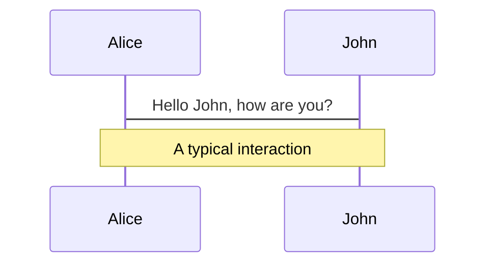
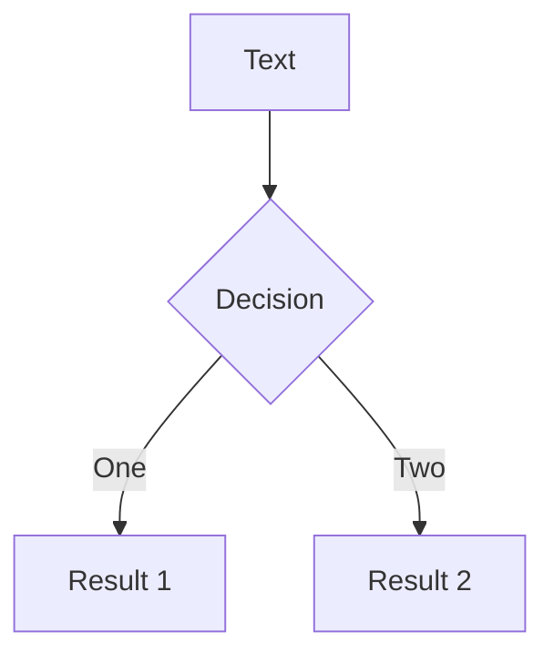

---
# try also 'default' to start simple
theme: light-icons
# random image from a curated Unsplash collection by Anthony
# like them? see https://unsplash.com/collections/94734566/slidev
background: https://source.unsplash.com/collection/94734566/1920x1080
# apply any windi css classes to the current slide
class: 'text-right'
# https://sli.dev/custom/highlighters.html
highlighter: shiki
# some information about the slides, markdown enabled
info: |
  ## Slidev Starter Template
  Presentation slides for developers.

  Learn more at [Sli.dev](https://sli.dev)

layout: image-header-intro
imageHeader: '../assets/images/light-icon-logo.svg'
imageRight: '../assets/images/light-icons-landing.svg'
---

# Scipy


Nhóm 6: 
<div style="text-align: right" > Nguyễn Chí Thanh</div>
<div style="text-align: right"> Đoàn Đại Thanh Long</div>
<div style="text-align: right"> Lê Thị Thắm</div>

<!--
The last comment block of each slide will be treated as slide notes. It will be visible and editable in Presenter Mode along with the slide. [Read more in the docs](https://sli.dev/guide/syntax.html#notes)
-->

---

# MỤC LỤC


- Giới thiệu và tổng quan về Scipy
- Cấu trúc thư viện
- Chi tiết các module

<br>
<br>


<!--
You can have `style` tag in markdown to override the style for the current page.
Learn more: https://sli.dev/guide/syntax#embedded-styles
-->

<style>
h1 {
  background-color: #2B90B6;
  background-image: linear-gradient(45deg, #4EC5D4 10%, #146b8c 20%);
  background-size: 100%;
  -webkit-background-clip: text;
  -moz-background-clip: text;
  -webkit-text-fill-color: transparent;
  -moz-text-fill-color: transparent;
}
</style>

---

# 1. Giới thiệu và tổng quan về Scipy

- Scipy là một thư viện mã nguồn mở dành cho toán học, khoa học và kỹ thuật. Scipy bao gồm các module về thống kê, tối ưu hóa, tích phân, đại số tuyến tính, xử lý tín hiệu,…

- Các đặc điểm của Scipy:
  - Mã nguồn mở
  - Dễ sử dụng, cộng đồng lớn
  - Hiệu năng cao
  - Dựa trên numpy, phù hợp tính toán với các mảng nhiều chiều
  - Áp dụng được trên nhiều lĩnh vực
Cung cấp nhiều công cụ liên quan đến toán học, thống kê,…
Liên quan mật thiết đến các thư viện tạo nên một hệ sinh thái: Numpy, Matplotlib, Scipy, Scikit-Image, Scikit-learn,…

<style>
h1 {
  background-color: #2B90B6;
  background-image: linear-gradient(45deg, #4EC5D4 10%, #146b8c 20%);
  background-size: 100%;
  -webkit-background-clip: text;
  -moz-background-clip: text;
  -webkit-text-fill-color: transparent;
  -moz-text-fill-color: transparent;
}
</style>

---

# 2. Cấu trúc thư viện

|Module| Miêu tả|
|------|---------|
|scipy.cluster|Các thuật toán phân cụm (Scikit-learn cũng có)|
|scipy.constants|Các hằng số toán học và vật lý|
|scipy.fftpack|Các hàm biến đổi Fourier nhanh (cũ)|
|fft|Các hàm biến đổi Fourier|
|integrate|Các hàm tính tích phân|
|io|Thao tác nhập xuất dữ liệu|
|linagl|Các thuật toán đại số tuyến tính|
|ndimage|Các thuật toán xử lý ảnh|
|odr|Hồi quy khoảng cách trực giao|
|optimize| Các thuật toán tối ưu hóa và tìm root|
|signal| Các thuật toàn xử lý tín hiệu|
|sparse| Các chương trình liên quan đến ma trận thưa|
|spatial| Các thuật toàn và cấu trực dữ liệu về không gian|
|special| Các hàm toàn học đặc biệt|
|stats| Các hàm, các phân phối về thống kê|
|weave| Công cụ cho phép sử dụng C/C++ trong code Python|
|misc| Một số hàm, công cụ khác|

Khó hiểu
<style>
h1 {
  background-color: #2B90B6;
  background-image: linear-gradient(45deg, #4EC5D4 10%, #146b8c 20%);
  background-size: 100%;
  -webkit-background-clip: text;
  -moz-background-clip: text;
  -webkit-text-fill-color: transparent;
  -moz-text-fill-color: transparent;
}
</style>
---
# 2. Cấu trúc thư viện

---
layout: image-right
image: https://source.unsplash.com/collection/94734566/1920x1080
---
# Code

Use code snippets and get the highlighting directly!

<!-- https://sli.dev/guide/syntax.html#line-highlighting -->

```python {all|2|1-6|9|all}
from scipy.fft import fft, fftfreq
# Number of sample points
N = 600
# sample spacing
T = 1.0 / 800.0
x = np.linspace(0.0, N*T, N, endpoint=False)
y = np.sin(50.0 * 2.0*np.pi*x) + 0.5*np.sin(80.0 * 2.0*np.pi*x)
yf = fft(y)
xf = fftfreq(N, T)[:N//2]
import matplotlib.pyplot as plt
plt.plot(xf, 2.0/N * np.abs(yf[0:N//2]))
plt.grid()
plt.show()
```

<arrow v-click="3" x1="400" y1="420" x2="230" y2="330" color="#564" width="3" arrowSize="1" />

---

# Components

<div grid="~ cols-2 gap-4">
<div>

You can use Vue components directly inside your slides.

We have provided a few built-in components like `<Tweet/>` and `<Youtube/>` that you can use directly. And adding your custom components is also super easy.

```html
<Counter :count="10" />
```

<!-- ./components/Counter.vue -->
<Counter :count="10" m="t-4" />

Check out [the guides](https://sli.dev/builtin/components.html) for more.

</div>
<div>

```html
<Tweet id="1390115482657726468" />
```

<Tweet id="1390115482657726468" scale="0.65" />

</div>
</div>


---
class: px-20
---

# Themes

Slidev comes with powerful theming support. Themes are able to provide styles, layouts, components, or even configurations for tools. Switching between themes by just **one edit** in your frontmatter:

<div grid="~ cols-2 gap-2" m="-t-2">

```yaml
---
theme: default
---
```

```yaml
---
theme: seriph
---
```


</div>

Read more about [How to use a theme](https://sli.dev/themes/use.html) and
check out the [Awesome Themes Gallery](https://sli.dev/themes/gallery.html).

---
preload: false
---

# Animations

Animations are powered by [@vueuse/motion](https://motion.vueuse.org/).

```html
<div
  v-motion
  :initial="{ x: -80 }"
  :enter="{ x: 0 }">
  Slidev
</div>
```

<div class="w-60 relative mt-6">
  <div class="relative w-40 h-40">
    
    
    
  </div>

  <div
    class="text-5xl absolute top-14 left-40 text-[#2B90B6] -z-1"
    v-motion
    :initial="{ x: -80, opacity: 0}"
    :enter="{ x: 0, opacity: 1, transition: { delay: 2000, duration: 1000 } }">
    Slidev
  </div>
</div>

<!-- vue script setup scripts can be directly used in markdown, and will only affects current page -->
<script setup lang="ts">
const final = {
  x: 0,
  y: 0,
  rotate: 0,
  scale: 1,
  transition: {
    type: 'spring',
    damping: 10,
    stiffness: 20,
    mass: 2
  }
}
</script>

<div
  v-motion
  :initial="{ x:35, y: 40, opacity: 0}"
  :enter="{ y: 0, opacity: 1, transition: { delay: 3500 } }">

[Learn More](https://sli.dev/guide/animations.html#motion)

</div>

---

# LaTeX

LaTeX is supported out-of-box powered by [KaTeX](https://katex.org/).

<br>

Inline $\sqrt{3x-1}+(1+x)^2$

Block
$$
\begin{array}{c}

\nabla \times \vec{\mathbf{B}} -\, \frac1c\, \frac{\partial\vec{\mathbf{E}}}{\partial t} &
= \frac{4\pi}{c}\vec{\mathbf{j}}    \nabla \cdot \vec{\mathbf{E}} & = 4 \pi \rho \\

\nabla \times \vec{\mathbf{E}}\, +\, \frac1c\, \frac{\partial\vec{\mathbf{B}}}{\partial t} & = \vec{\mathbf{0}} \\

\nabla \cdot \vec{\mathbf{B}} & = 0

\end{array}
$$

<br>

[Learn more](https://sli.dev/guide/syntax#latex)

---

# Diagrams

You can create diagrams / graphs from textual descriptions, directly in your Markdown.

<div class="grid grid-cols-2 gap-4 pt-4 -mb-6">





</div>

[Learn More](https://sli.dev/guide/syntax.html#diagrams)


---
layout: center
class: text-center
---

# Learn More

[Documentations](https://sli.dev) / [GitHub Repo](https://github.com/slidevjs/slidev)
